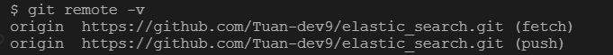

# Create git repo local and push to remote

### Link references

https://docs.github.com/en/migrations/importing-source-code/using-the-command-line-to-import-source-code/adding-locally-hosted-code-to-github

### Step 1: Open git bash and navigatte to the root of project

### Step 2: Init local repo

```
git init -b main
```

### Step 3: Add and Commit

```
git add .
git commit -m "First commit"
```

### Step 4: Create git remote repo in github


### Step 5: Set the git remote repo

```
git remote add origin <REMOTE URL>
```

```
git remote -v // Verifies the new remote URL
```



### Step 6: Push the changes

```
git push origin main
```
      
## Err: Authentication failed


```
git push -u origin main
```
link references: 
https://stackoverflow.com/questions/17659206/git-push-results-in-authentication-failed
